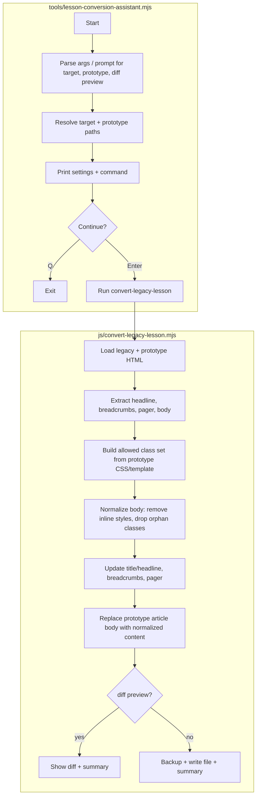

# Lesson Conversion Flow

This diagram shows the CLI assistant flow plus the core converter pipeline.

Notes:
- Diff preview is enabled by default; use `--no-diff-preview` to write changes.
- Normalization removes inline `style` attributes and class tokens not present in prototype CSS/template.
- Deployment context: domain root `/`.
